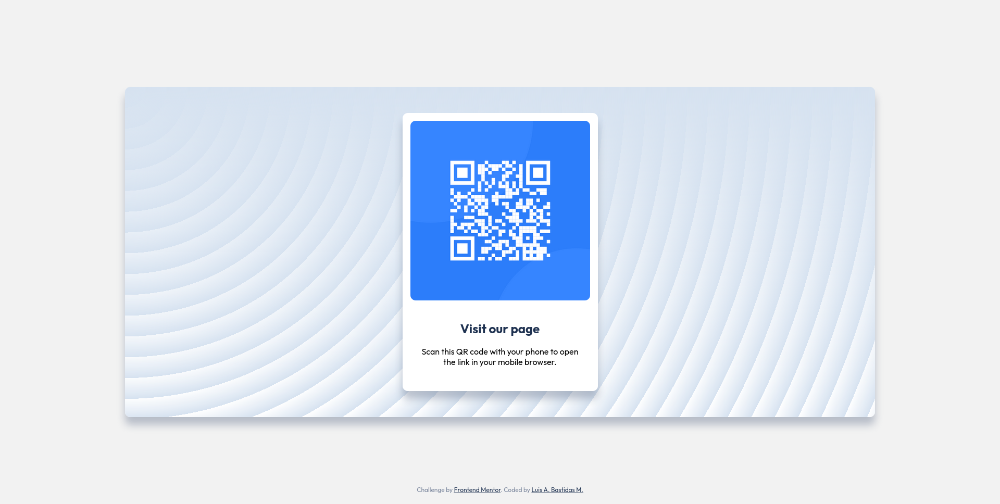

# Frontend Mentor - QR code component solution

This is a solution to the [QR code component challenge on Frontend Mentor](https://www.frontendmentor.io/challenges/qr-code-component-iux_sIO_H). Frontend Mentor challenges help you improve your coding skills by building realistic projects. 

## Table of contents

- [Overview](#overview)
  - [Screenshot](#screenshot)
  - [Links](#links)
- [My process](#my-process)
  - [Built with](#built-with)
  - [Continued development](#continued-development)
  - [Useful resources](#useful-resources)
- [Author](#author)

## Overview

### Screenshot

### Links

- Solution URL: [Add solution URL here](https://github.com/mbastidasluis/qr-code-card)
- Live Site URL: [Add live site URL here](https://mbastidasluis.github.io/qr-code-card/)

## My process

### Built with

- Semantic HTML5 markup
- CSS custom properties
- Flexbox

### Continued development

- Turn the card into a web component.

### Useful resources

- [[Magic Pattern](https://www.magicpattern.design/tools/css-backgrounds) - This helped me create a beautiful pattern for the background of the card.

## Author

- Website - [Luis A. Bastidas M.](https://github.com/mbastidasluis)
- Frontend Mentor - [@mbastidasluis](https://www.frontendmentor.io/profile/mbastidasluis)